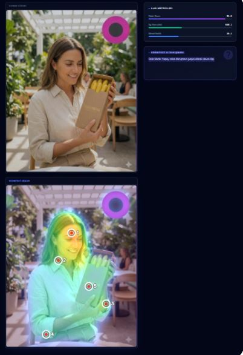

#### 2. Repo: `kognitect-visual-attention-engine` İçin README

# 👁️ Kognitect Visual Attention Engine

**Version:** v1.2.0 (Internal Alpha)
**Research Lead:** [Dr. Bektaş Sarı](https://github.com/bektas-sari)

---

## 🧪 Overview
The **Visual Attention Engine** is a proprietary Python-based tool developed by Kognitect. It predicts human eye-fixation points (saliency) on digital interfaces without needing physical eye-tracking hardware.

Based on **Deep Learning** models and **Computer Vision** principles, this engine helps UI/UX designers optimize layouts before A/B testing.

---

## ⚙️ How It Works

1.  **Input:** A screenshot or mock-up of a UI design.
2.  **Processing:**
    * Image preprocessing (OpenCV normalization).
    * Saliency Map Generation (U-2-Net Architecture).
    * Heatmap Overlay (Matplotlib/Seaborn).
3.  **Output:** A visual heatmap indicating "Hot Spots" (High Attention) vs "Cold Spots" (Ignored Areas).

---

## 💻 Tech Stack

* **Language:** Python 3.11+
* **Computer Vision:** OpenCV (`cv2`), Pillow
* **Data Science:** NumPy, Pandas
* **Visualization:** Matplotlib, Seaborn

---

## 📊 Sample Output (Simulation)

> *## 📊 Sample Output (Simulation)

> **Analysis Insight:** The engine identifies high fixation points (red zones) on the product packaging logo, confirming brand visibility, while providing real-time attention metrics via the dashboard sidebar.
> *The engine identifies that 80% of user attention is focused on the primary CTA button, validating the design hypothesis.*

---

## ⚠️ Disclaimer
This repository contains the **architectural documentation** and **public research notes**. The core algorithm and trained models are closed-source intellectual property of **Kognitect**.
